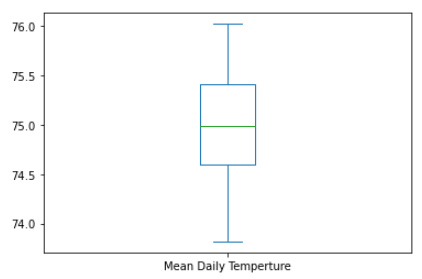

# Surfs Up - Exploring Weather Data

## 1 Overview 

The analysis was conducted in support of a Surf and Shakes shop idea that I had while vacationing in Hawaii, because I required investors to finance the operations.  I reached out the a famous surfer, W. Avy, who likes my business plan but needs more detail.   I conducted some  preliminary analysis, but he wants more information about temperature trends before investing in the surf shop idea. He is specifically interested in temperature data for the months of June and December in Oahu.  He will be using this information to determine if a surf and ice cream shop business could be sustainable year-round.

## 2 Results

The following sections discuss the analysis of weather data for the island of Oahu.  The derivation of statistical data for the months of June and December are presented in sections 2.1 and 2.2 respectively.  In addition to the requested statistical analysis of the monthly data I have also added queries to extract average daily information for both temperature and precipitation.  This analysis can be found at the end of each of these two sections.  In section 2.3, I discuss in further detail the outliers that exist and how there affect the data and how they can appropriately be explained to investors.

### 2.1 Analysis of June Weather

Analysis of the weather involved establishing a connection with a SQLite database that contains temperature and precipitations readings from 2010 to 2017.  The database query was written to retrieve temperatures for the month of June from "Measurement" table.  It should be noted that we wanted to get June data for all years so that we would have a good representation of  June's typical weather.  The query is shown in the code fence  below.

```python
sel = [Measurement.tobs]
June_Query = session.query(*sel).\
    filter(func.strftime("%m", Measurement.date) == "06")
```


Creating and empty list and then iterating through the rows of the query we were then able to construct a list of June temperature data.

```python
June_List = []
for row in June_Query: June_List.append(row)
```


The list of temperatures was then converted to a Pandas DataFrame with one column "June Temps" and 1700 rows of temperature measurements.

```python
June_df = pd.DataFrame(June_List, columns=['June Temps'])
```


Finally the summary statistical information was generated for the month using the code below.  

```python
June_df.describe()
```


The resulting statistics for June can be found in figure 1 below.


***Figure 1 - Summary Statistics June Temperatures***

#### Additional Analysis for June

Wanting to ensure that the investors had a really good idea of how good the weather is in Oahu I did a deep dive of weather data for June.  Similar to the initial analysis, the query below extracts the date, temperature and precipitation data from all the years for the month of June.

```python
sel = [Measurement.date, Measurement.tobs, Measurement.prcp]
June_Query2 = session.query(*sel).\
    filter(func.strftime("%m", Measurement.date) == "06")
```

Here is the part where the analysis is very different, we extract information by day of the month for days in June. 

```python
June_df['day'] = pd.DatetimeIndex(June_df['Date']).day
```

With seven years of data for June, grouped by day of the month as in the code below, we are now able to view how temperature changes on a daily basis.

```python
June_df2 = []
June_df2 = June_df.groupby('day')['June Temps'].mean().to_frame('Mean Daily Temperture')
June_df2.plot(kind='box')
```

 

In figure 2, the behavior of temperature over the month of June in Oahu, can be seen as very stable with Q1 and Q3 between 74.5 and 75.5.



***Figure 2 - Box Plot of June Temperatures***

```python
June_df3 = []
June_df3 = June_df.groupby('day')['June Rain'].mean().to_frame('Mean Daily Precipitation')
June_df3.plot( kind='box')
```

Conducting a similar analysis on precipitation for June we can see, in figure 3 below, a low mean daily rainfall.  There is however one outlier, outliers will be discussed in section 2.3.


***Figure 3 - Box Plot of June Precipitation***

### 2.2 Analysis of December Weather

Similar to the analysis of the weather in June, we establishing a connection with a SQLite database that contains temperature and precipitations readings from 2010 to 2017.  The database query was written to retrieve temperatures for the month of December from "Measurement" table.  It should be noted that we wanted to get December data for all years so that we would have a good representation of  December's typical weather.  The query is shown in the code fence  below.

```python
sel = [Measurement.tobs]
Dec_Query = session.query(*sel).\
    filter(func.strftime("%m", Measurement.date) == "12")
```


Creating and empty list and then iterating through the rows of the query we were then able to construct a list of December temperature data.

```python
Dec_List = []
for row in Dec_Query: Dec_List.append(row)
```


The list of temperatures was then converted to a Pandas DataFrame with one column "December Temps" and 1517 rows of temperature measurements.

```python
Dec_df = pd.DataFrame(Dec_List, columns=['December Temps'])
```


Finally the summary statistical information was generated for the month using the code below.  

```python
Dec_df.describe()
```


The resulting statics for December can be found in figure 4 below.


***Figure 4 - Summary Statistics December Temperatures***

#### Additional Analysis for December

Again, wanting to ensure that the investors had a really good idea of how good the weather is in Oahu I also did a deep dive of weather data for December.  Similar to the initial analysis, the query below extracts the date, temperature and precipitation data from all the years for the month of December.

```python
sel = [Measurement.date, Measurement.tobs, Measurement.prcp]
Dec_Query2 = session.query(*sel).\
    filter(func.strftime("%m", Measurement.date) == "12")
```

Here is the part where the analysis is again very different, we extract information by day of the month for days in December.

```python
Dec_df['day'] = pd.DatetimeIndex(Dec_df['Date']).day
```

With seven years of data for December grouped by day of the month, as in the code below, we are now able to view how temperature changes on a daily basis.

```python
Dec_df2 = []
Dec_df2 = Dec_df.groupby('day')['Dec Temps'].mean().to_frame('Mean Daily Temperture')
Dec_df2.plot(kind='box')
```


In figure 5, the behavior of temperature over the month of December in Oahu, can be seen as very stable with Q1 and Q3 between about 70.5 and 72.0.  Note how the median temperature is towards the high end of the range. 


***Figure 5 - Box Plot of December Temperatures***

```python
Dec_df3 = []
Dec_df3 = Dec_df.groupby('day')['Dec Rain'].mean().to_frame('Mean Daily Precipitation')
Dec_df3.plot( kind='box')
```

Conducting a similar analysis on precipitation for December and again we can see, in figure 6 below, a higher but still relatively low mean daily rainfall.  Notice also that the median rainfall is skewed to the low end of the scale. There are however two outliers, a discussion of outliers in section 2.3 will use this case a a specific example for investors.


***Figure 6 - Box Plot of December Precipitation***

### 2.3 Outliers Explained

The precipitation data presented in figure 6 of section 2.2 above, is an excellent example of an outlier.  Outliers are data points that lie more than 1.5 times the interquartile range (IQR) from the median.  I conducted a query on the dataframe to find the two points of interest.  You will see in figure 7 that they occurred on day 19 and day 20 of the December mean daily data.


***Figure 7 - December Precipitation Outliers***

Filtering the dataframe where the 'day' column was first added you can see that in December of 2010 a significant storm was recorded in Oahu.  With numerous reading above 3 inches of rain the outliers were created.


***Figure 8 - December Outliers Explained***

It is really important to understand that these outliers can be explained by events that happen extremely rarely and that the Q1 to Q3 indicators should be accepted as representation of a typical December day in Oahu.

## 3 Summary

Looking at monthly statistics for two month in the year as well as daily trends for each of these months has confirmed that Oahu will be and excellent place to set up a Surf and Shakes shop.  

#### Observations

- December has lower mean temperatures than June, but the difference is less than four degrees.
- December  temperatures have higher variably than June, but both months median temperature is in the seventies.
- December and June surprisingly have very similar maximum temperatures.  This mean in either month we can expect to see temperatures in the low eighties - hot enough for surfing and drinking shakes, but not so hot that people want to stay at home.

#### Bottom-line

W. Avy and his fellow investors have a great opportunity to invest in what will certainly be a new venture that will likely become a franchise.


